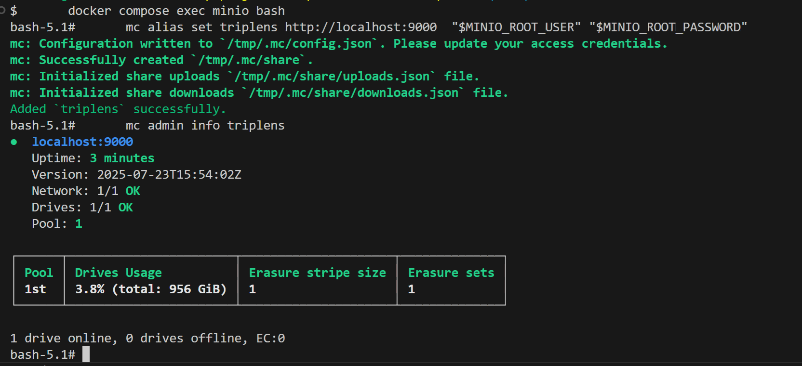

## TripLens Countries Explorer: Global Travel Intelligence 
  ### Introduction
  A data engineering pipeline project that turns public country data into travel-ready analytics for tourists and travelers exploring new destinations. 
  
  The goal is to help people quickly understand the essentials about a country before they make their move. 
  Key facts like region, language, currency, time zone, neighboring countries, and other helpful background details that can influence planning and decision-making.

  ### Project Setup Guide
  This guide will walk you through setting up the project environment, minio configurations and setting up credentials in Apache Airflow

  Prerequisites
  - Python 3.11.5 or higher
  - Git
  - MinIO Docker Image (AWS s3 compatible object storage)
  - Snowflake Account
  - DBT
  - Docker Desktop
  - Apache Airflow (Astro CLI) 
  
  
  ### Step 1: Clone the Repository
  ```bash
    # Clone the repository
    git clone https://github.com/ioaviator/triplens-countries-explorer.git

    # Navigate to project directory
    cd triplens-countries-explorer
  ```

  ### Step 2: Setup Configuration Files
  ```bash
    # Create a .env file in project root directory
    MINIO_ENDPOINT=http://minio:9000
  ```

  ```bash
    # Set these environment variables
      export MINIO_ROOT_USER=<admin_username>
      export MINIO_ROOT_PASSWORD=<admin_password>
  ```

  ### Step 3: Start Apache Airflow Instance
  ```bash
    # Start up apache airflow instance
      astro dev start
    
    # Restart apache airflow instance
      astro dev restart
      
    # (Optional) Stop the containers
      astro dev stop
    
    # Navigate to container url
    # Login with environment variable credentials  ( MINIO_ROOT_USER, MINIO_ROOT_PASSWORD )
      http://localhost:9001
    
    # Check what the container received from compose file ( The values will be used for ACCESS KEY AND SECRET KEY)
      docker compose exec minio sh -lc 'echo "USER=$MINIO_ROOT_USER"; echo "PASS=$MINIO_ROOT_PASSWORD"'

    # Check your compose-resolved config (host side). Run from root folder that contains docker-compose.override.yml and .env file
      docker compose config | sed -n '/minio:/,/^[^ ]/p'

    # Login into the MinIO container
      docker compose exec minio bash
      
    # Create the admin alias 
      mc alias set triplens http://localhost:9000  "$MINIO_ROOT_USER" "$MINIO_ROOT_PASSWORD"

    # (Optional) Delete the admin alias
      mc alias rm triplens
    
    # Validate admin access
      mc admin info triplens
    
    # Verify successful admin access key and secret key invocation  (Check for your alias name. )
      mc alias list
    
    # Create a Bucket using `mc` Or navigate to the URL and create the bucket 

      mc mb -p triplens/triplens-data

    # List all buckets
      mc ls triplens

    # List Bucket Contents (Use the url to upload objects to the created bucket)
      mc ls triplens/triplens-data
  ```
  

  ### Step 4: Load Data into Bucket
  ```bash

  ```

  


<!-- 
  ### Step 2: Start Astro Project

    # Start the Astro development environment
    astro dev start

  This will:
  - Set up a local Airflow environment
  - Start Airflow services in Docker containers -->